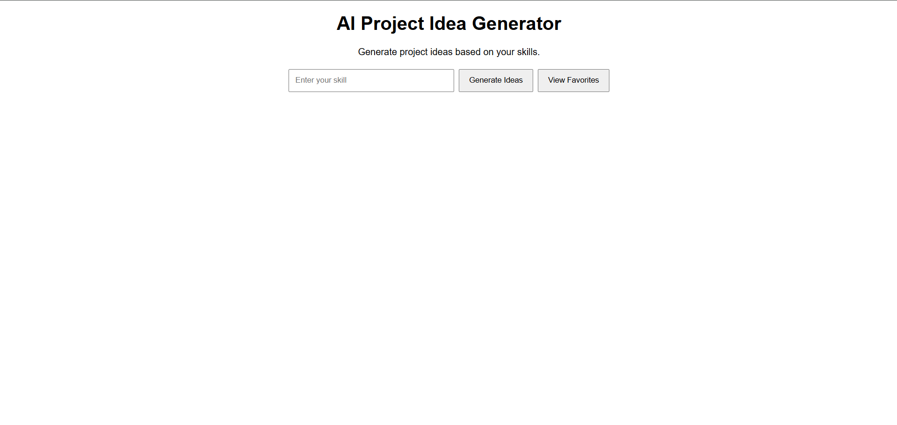
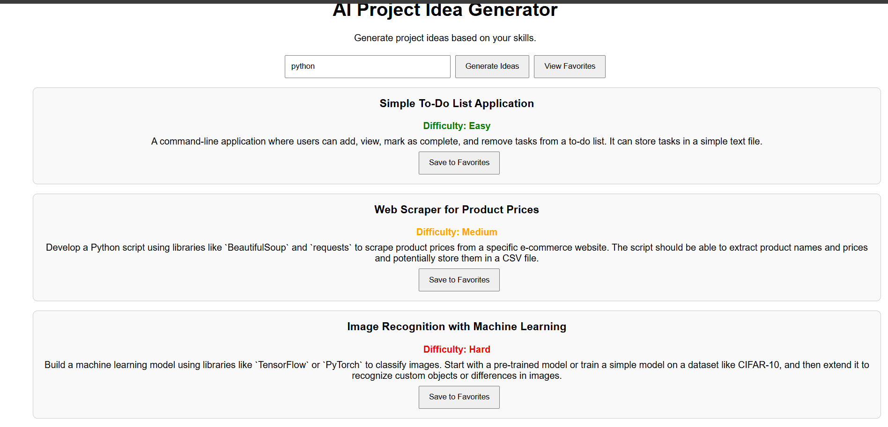
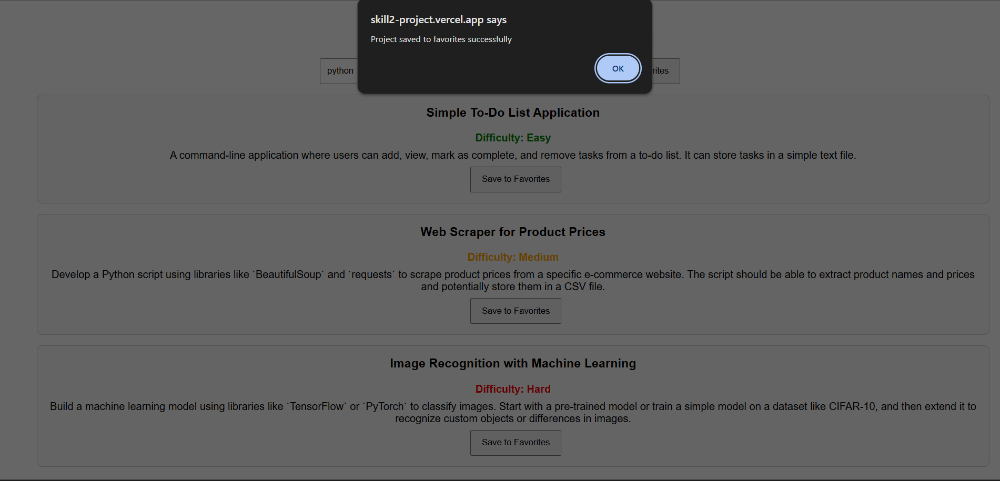
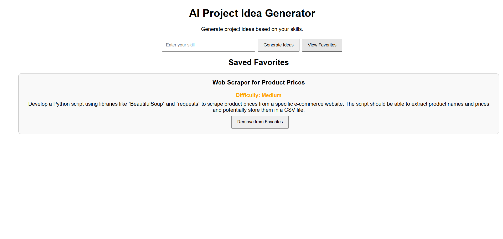

# Skill2Project - AI Project Idea Generator

## Overview

Skill2Project is an AI-powered MERN Stack web application that generates project ideas based on a user's skills. The application uses OpenRouter AI to create personalized project suggestions and allows users to save their favorite ideas for future reference.

## Features

* Generate AI-powered project ideas based on skills
* Projects categorized into Easy, Medium, and Hard difficulty levels
* Save project ideas to favorites
* View saved favorites
* Remove projects from favorites
* Duplicate favorite prevention
* MongoDB Atlas integration
* Responsive user interface

## Tech Stack

### Frontend

* React.js
* Vite
* CSS

### Backend

* Node.js
* Express.js

### Database

* MongoDB Atlas
* Mongoose

### AI Integration

* OpenRouter AI

### Deployment

* Vercel (Frontend)
* Render (Backend)

## Project Structure

Skill2Project/
├── client/
│ ├── src/
│ │ ├── components/
│ │ ├── App.jsx
│ │ └── main.jsx
│ └── package.json
│
├── server/
│ ├── controllers/
│ ├── models/
│ ├── routes/
│ ├── services/
│ ├── config/
│ └── server.js
│
└── README.md

## Installation

### Clone Repository

git clone https://github.com/9124104188-art/Skill2Project.git

cd Skill2Project

### Install Frontend Dependencies

cd client

npm install

npm run dev

### Install Backend Dependencies

cd ../server

npm install

npm start

## Environment Variables

Create a .env file inside the server folder.

MONGO_URI=your_mongodb_connection_string

OPENROUTER_API_KEY=your_openrouter_api_key

## API Endpoints

### Generate Project Ideas

GET /api/projects?skill=javascript

### Save Favorite

POST /api/projects/favorites

### View Favorites

GET /api/projects/favorites

### Delete Favorite

DELETE /api/projects/favorites/:id

## Screenshots

### Home Page

The landing page where users can enter their skills and generate project ideas.

---

### AI Generated Project Ideas

The application generates Easy, Medium, and Hard project ideas using OpenRouter AI based on the user's skills.

---

### Save Favorite Project

Users can save generated project ideas to MongoDB Atlas for future reference.

---

### View Saved Favorites

Users can view and manage their saved favorite project ideas.

---

## Live Demo

https://skill2-project.vercel.app/

## Future Enhancements

* User Authentication
* Search Favorites
* Project Roadmaps
* Skill Recommendations
* Project Export Feature
* Project Sharing

## Author

S. Yeswanth Kumar

B.E Computer Science and Engineering

KCG College of Technology

## License

This project is created for educational and portfolio purposes.
